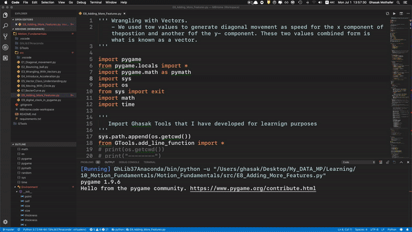

# Moving Car Simulator -1-

This program is developing a motion in 2d-Top View for a Car, using Pygame library.

## Getting Started
These instructions will get you a copy of the project up and running on your local machine for development and testing purposes. See deployment for notes on how to deploy the project on a live system.
### Prerequisites
What things you need to install the software and how to install them
```
pip install requirements.txt
```

## Python Version

I have used Python3.7 Anaconda. and pygame 1.9.6
See the results:



## Authors

* **Ghasak Ibrahim** - *Initial work* -

## License
This project is licensed under the MIT License - see the [LICENSE.md](LICENSE.md) file for details
## Acknowledgments
* Hat tip to anyone whose code was used

## Inspiration
Following similar project at:
* [contributors] (http://rmgi.blog./pygame-2d-car-tutorial.html )
